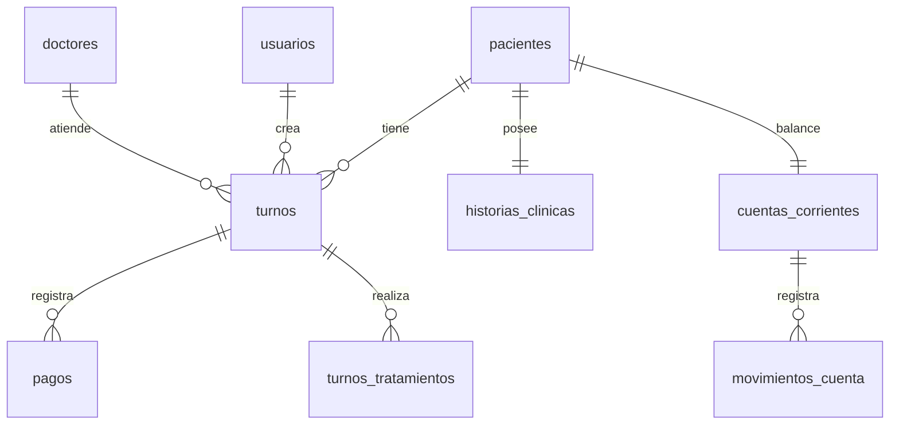

# Auditoría Técnica del Backend — OdontoGest

Este documento actúa como relevamiento técnico detallado y fuente de verdad del backend actual (`backend/`) para complementar a [AUDITORIA_FRONTEND.md](file:///d:/____PROYECTOS/SISTEMA%20TURNOS%20ODONTOLOGIA/Dental-Appointment-System/docs/AUDITORIA_FRONTEND.md) en el diseño de `frontend2/`. Permite conocer los contratos reales, esquemas Pydantic y restricciones del sistema.

---

## 1. Índice de routers

| Prefijo del Router | Archivo del Router | Roles Permitidos por Defecto | Roadmap Change |
| :--- | :--- | :--- | :--- |
| `/auth` | [auth.py](file:///d:/____PROYECTOS/SISTEMA%20TURNOS%20ODONTOLOGIA/Dental-Appointment-System/backend/routers/auth.py) | Público (Sin auth por defecto) | C-06 `auth-y-autorizacion` |
| `/admin` | [admin.py](file:///d:/____PROYECTOS/SISTEMA%20TURNOS%20ODONTOLOGIA/Dental-Appointment-System/backend/routers/admin.py) | `admin` | C-06 `auth-y-autorizacion` |
| `/pacientes` | [pacientes.py](file:///d:/____PROYECTOS/SISTEMA%20TURNOS%20ODONTOLOGIA/Dental-Appointment-System/backend/routers/pacientes.py) | `admin` \| `secretaria` | C-02 `gestion-pacientes-y-turnos`   C-04 `cuentas-corrientes-y-deudores` |
| `/turnos` | [turnos.py](file:///d:/____PROYECTOS/SISTEMA%20TURNOS%20ODONTOLOGIA/Dental-Appointment-System/backend/routers/turnos.py) | `admin` \| `secretaria` | C-02 `gestion-pacientes-y-turnos`   C-03 `finanzas-y-caja-diaria` |
| `/doctores` | [doctores.py](file:///d:/____PROYECTOS/SISTEMA%20TURNOS%20ODONTOLOGIA/Dental-Appointment-System/backend/routers/doctores.py) | `admin` \| `secretaria` | C-02 `gestion-pacientes-y-turnos` |
| `/finanzas` | [finanzas.py](file:///d:/____PROYECTOS/SISTEMA%20TURNOS%20ODONTOLOGIA/Dental-Appointment-System/backend/routers/finanzas.py) | `admin` \| `secretaria` | C-03 `finanzas-y-caja-diaria` |
| `/catalogo` | [catalogo.py](file:///d:/____PROYECTOS/SISTEMA%20TURNOS%20ODONTOLOGIA/Dental-Appointment-System/backend/routers/catalogo.py) | Público (GET)   `admin` \| `secretaria` (POST/PUT/DELETE) | C-07 `catalogo-tratamientos` |

> [!NOTE]
> *Reescritura de Rutas:* Aunque en FastAPI los prefijos se declaran sin `/api`, el servidor de desarrollo de Vite redirige las peticiones desde `/api/*` hacia `http://localhost:8000/*` eliminando el prefijo mediante una regla de reescritura (`rewrite: (path) => path.replace(/^\/api/, '')`).

---

## 2. Inventario completo de endpoints

### 2.1. Router de Autenticación (`/auth`)

#### `POST /auth/login`
- **Request Body:** `LoginRequest`
  - `username`: `str` (requerido)
  - `password`: `str` (requerido)
- **Response Shape:** `TokenResponse` (200 OK)
  - `access_token`: `str`
  - `refresh_token`: `str`
  - `token_type`: `str` (default `"bearer"`)
- **Errores Posibles:**
  - `401 Unauthorized`: "Credenciales inválidas" (si el usuario no existe, está inactivo, o la contraseña es errónea).
- **Roles Permitidos:** Público (no requiere cabecera de autenticación).
- **Rate Limiting:** Ninguno aplicado en código.
- **Estado:** ✅ Consumido por el frontend actual.

#### `POST /auth/refresh`
- **Request Body:** `TokenRefreshRequest`
  - `refresh_token`: `str` (requerido)
- **Response Shape:** `TokenResponse` (200 OK)
- **Errores Posibles:**
  - `401 Unauthorized`: "Refresh token inválido o expirado" o "Token inválido".
- **Roles Permitidos:** Público.
- **Rate Limiting:** Ninguno aplicado en código.
- **Estado:** ✅ Consumido por el frontend actual.

#### `POST /auth/logout`
- **Request Body:** Ninguno (usa cabecera `Authorization: Bearer <token>`).
- **Response Shape:** `{"mensaje": "Sesión cerrada correctamente"}` (200 OK).
- **Errores Posibles:**
  - `401 Unauthorized`: Si el token es inválido o inactivo.
- **Roles Permitidos:** Autenticados (cualquier rol válido).
- **Rate Limiting:** Ninguno.
- **Estado:** ✅ Consumido por el frontend actual.

#### `GET /auth/me`
- **Request Body:** Ninguno (usa cabecera `Authorization: Bearer <token>`).
- **Response Shape:** `UserResponse` (200 OK)
  - `id`: `int`
  - `username`: `str`
  - `rol`: `str`
  - `activo`: `bool`
  - `creado_en`: `datetime`
- **Errores Posibles:**
  - `401 Unauthorized`.
- **Roles Permitidos:** Autenticados (cualquier rol válido).
- **Rate Limiting:** Ninguno.
- **Estado:** ⚠️ **No consumido** por el frontend actual (dead code).

---

### 2.2. Router de Administración (`/admin`)
*Nota:* Todo el router hereda la dependencia `require_role(["admin"])` en su definición.

#### `POST /admin/usuarios`
- **Request Body:** `UserCreate`
  - `username`: `str` (requerido)
  - `password`: `str` (requerido)
  - `rol`: `str` (default `"secretaria"`)
- **Response Shape:** `UserResponse` (201 Created)
- **Errores Posibles:**
  - `401 Unauthorized` / `403 Forbidden`.
  - `400 Bad Request`: "Solo se puede crear rol secretaria" (si se envía otro rol).
- **Roles Permitidos:** `admin`.
- **Estado:** ✅ Consumido por el frontend actual.

#### `GET /admin/usuarios`
- **Request Body:** Ninguno.
- **Response Shape:** `list[UserResponse]` (200 OK)
- **Roles Permitidos:** `admin`.
- **Estado:** ✅ Consumido por el frontend actual.

#### `PUT /admin/usuarios/{user_id}/toggle-activo`
- **Request Body:** Ninguno (Path parameter `user_id`).
- **Response Shape:** `UserResponse` (200 OK)
- **Errores Posibles:**
  - `404 Not Found`: "Usuario no encontrado".
- **Roles Permitidos:** `admin`.
- **Estado:** ✅ Consumido por el frontend actual.

#### `DELETE /admin/usuarios/{user_id}`
- **Request Body:** Ninguno (Path parameter `user_id`).
- **Response Shape:** `{"mensaje": "Usuario <username> eliminado"}` (200 OK)
- **Errores Posibles:**
  - `404 Not Found`: "Usuario no encontrado".
  - `400 Bad Request`: "No se puede eliminar un admin".
- **Roles Permitidos:** `admin`.
- **Estado:** ✅ Consumido por el frontend actual.

#### `PUT /admin/usuarios/{user_id}`
- **Request Body:** `UserUpdate`
  - `username`: `Optional[str]`
  - `password`: `Optional[str]`
  - `current_password`: `Optional[str]`
- **Response Shape:** `UserResponse` (200 OK)
- **Errores Posibles:**
  - `400 Bad Request`: "Debe ingresar la contraseña actual" (si es self-edit del admin).
  - `403 Forbidden`: "Contraseña actual incorrecta".
  - `404 Not Found`: "Usuario no encontrado".
- **Roles Permitidos:** `admin`.
- **Estado:** ✅ Consumido por el frontend actual.

---

### 2.3. Router de Pacientes (`/pacientes`)
*Nota:* Todo el router requiere rol `admin` o `secretaria`.

#### `GET /pacientes/`
- **Request Body:** Ninguno.
- **Response Shape:** `list[PacienteResponse]` (200 OK)
  - `dni`: `str`
  - `nombre`: `str`
  - `apellido`: `str`
  - `fecha_nacimiento`: `Optional[date]`
  - `telefono`: `Optional[str]`
  - `email`: `Optional[EmailStr]`
  - `obra_social`: `Optional[str]`
- **Roles Permitidos:** `admin` \| `secretaria`.
- **Estado:** ✅ Consumido por el frontend actual.

#### `GET /pacientes/deudores`
- **Request Body:** Ninguno.
- **Response Shape:** `list[DeudorResponse]` (200 OK)
  - `dni`: `str`
  - `nombre`: `str`
  - `apellido`: `str`
  - `telefono`: `Optional[str]`
  - `saldo_ars`: `float`
  - `saldo_usd`: `float`
- **Roles Permitidos:** `admin` \| `secretaria`.
- **Estado:** ✅ Consumido por el frontend actual.

#### `GET /pacientes/historial`
- **Query Parameters:**
  - `dni`: `str` (requerido)
  - `fecha_desde`: `Optional[date]`
  - `fecha_hasta`: `Optional[date]`
- **Response Shape:** `HistorialPacienteResponse` (200 OK)
  - `dni_paciente`: `str`
  - `nombre`: `str`
  - `apellido`: `str`
  - `saldo_ars`: `float`
  - `saldo_usd`: `float`
  - `turnos`: `list[HistorialTurnoItemResponse]`
  - `totales`: `TotalesHistorial`
- **Errores Posibles:**
  - `404 Not Found`: "Paciente no encontrado".
- **Roles Permitidos:** `admin` \| `secretaria`.
- **Estado:** ✅ Consumido por el frontend actual.

#### `GET /pacientes/{dni}`
- **Request Body:** Ninguno (Path parameter `dni`).
- **Response Shape:** `PacienteResponse` (200 OK)
- **Errores Posibles:**
  - `404 Not Found`: "Paciente no encontrado".
- **Roles Permitidos:** `admin` \| `secretaria`.
- **Estado:** ✅ Consumido por el frontend actual.

#### `POST /pacientes/`
- **Request Body:** `PacienteCreate`
- **Response Shape:** `PacienteResponse` (201 Created)
- **Errores Posibles:**
  - `400 Bad Request`: "El DNI ya está registrado".
- **Roles Permitidos:** `admin` \| `secretaria`.
- **Estado:** ✅ Consumido por el frontend actual.

#### `PUT /pacientes/{dni}`
- **Request Body:** `PacienteUpdate`
  - `nombre`: `Optional[str]`
  - `apellido`: `Optional[str]`
  - `fecha_nacimiento`: `Optional[date]`
  - `telefono`: `Optional[str]`
  - `email`: `Optional[EmailStr]`
  - `obra_social`: `Optional[str]`
- **Response Shape:** `PacienteResponse` (200 OK)
- **Errores Posibles:**
  - `404 Not Found`: "Paciente no encontrado".
- **Roles Permitidos:** `admin` \| `secretaria`.
- **Estado:** ✅ Consumido por el frontend actual.

#### `GET /pacientes/{dni}/cuenta`
- **Request Body:** Ninguno (Path parameter `dni`).
- **Response Shape:** `CuentaCorrienteResponse` (200 OK)
  - `dni_paciente`: `str`
  - `saldo_ars`: `float`
  - `saldo_usd`: `float`
  - `ultima_actualizacion`: `Optional[datetime]`
  - `movimientos`: `list[MovimientoResponse]`
- **Errores Posibles:**
  - `404 Not Found`: "Paciente no encontrado".
- **Roles Permitidos:** `admin` \| `secretaria`.
- **Estado:** ✅ Consumido por el frontend actual.

---

### 2.4. Router de Turnos (`/turnos`)
*Nota:* Todo el router requiere rol `admin` o `secretaria`.

#### `GET /turnos/`
- **Query Parameters:**
  - `fecha`: `Optional[date]`
  - `id_doctor`: `Optional[int]`
  - `paciente_dni`: `Optional[str]`
- **Response Shape:** `list[TurnoResponse]` (200 OK)
  - `id`: `int`
  - `fecha_hora`: `datetime`
  - `motivo`: `Optional[str]`
  - `dni_paciente`: `str`
  - `id_doctor`: `int`
  - `estado`: `str`
  - `paciente`: `Optional[dict]` (`{nombre, apellido, dni, obra_social}`)
  - `doctor`: `Optional[dict]` (`{id, nombre}`)
- **Roles Permitidos:** `admin` \| `secretaria`.
- **Estado:** ✅ Consumido por el frontend actual.

#### `GET /turnos/hoy`
- **Request Body:** Ninguno.
- **Response Shape:** `list[TurnoResponse]` (200 OK)
- **Roles Permitidos:** `admin` \| `secretaria`.
- **Estado:** ✅ Consumido por el frontend actual.

#### `GET /turnos/paciente/{dni}`
- **Request Body:** Ninguno (Path parameter `dni`).
- **Response Shape:** `list[TurnoResponse]` (200 OK)
- **Errores Posibles:**
  - `404 Not Found`: "No se encontraron turnos para este paciente".
- **Roles Permitidos:** `admin` \| `secretaria`.
- **Estado:** ⚠️ **No consumido** por el frontend actual (dead code).

#### `POST /turnos/`
- **Request Body:** `TurnoCreate`
  - `fecha_hora`: `datetime` (requerido)
  - `motivo`: `Optional[str]`
  - `dni_paciente`: `str` (requerido)
  - `id_doctor`: `int` (requerido)
- **Response Shape:** `TurnoResponse` (201 Created)
- **Errores Posibles:**
  - `400 Bad Request`: "Los jueves no se atiende. Elegí otro día."
  - `400 Bad Request`: "Los domingos no se atiende. Elegí otro día."
  - `400 Bad Request`: "El horario de atención es de 9:00 a 19:00. Elegí otro horario."
  - `400 Bad Request`: "El doctor ya tiene un turno a esa hora".
- **Roles Permitidos:** `admin` \| `secretaria`.
- **Estado:** ✅ Consumido por el frontend actual.

#### `PATCH /turnos/{turno_id}/cancelar`
- **Request Body:** Ninguno (Path parameter `turno_id`).
- **Response Shape:** `TurnoResponse` (200 OK)
- **Errores Posibles:**
  - `404 Not Found`: "Turno no encontrado".
- **Roles Permitidos:** `admin` \| `secretaria`.
- **Estado:** ✅ Consumido por el frontend actual.

#### `DELETE /turnos/{turno_id}`
- **Request Body:** Ninguno (Path parameter `turno_id`).
- **Response Shape:** `{"mensaje": "Turno <id> eliminado correctamente"}` (200 OK)
- **Errores Posibles:**
  - `404 Not Found`: "Turno no encontrado".
- **Roles Permitidos:** `admin` \| `secretaria`.
- **Estado:** ⚠️ **No consumido** por el frontend actual.

#### `PUT /turnos/{turno_id}/cerrar`
- **Request Body:** `CerrarTurnoInput`
  - `tratamientos`: `list[TratamientoInput]` (`{nombre, cantidad, precio_ars, precio_usd}`)
  - `pagos`: `list[PagoInput]` (`{monto, moneda, metodo_pago}`)
  - `comentarios`: `Optional[str]`
- **Response Shape:** `CerrarTurnoResponse` (200 OK)
  - `turno_id`: `int`
  - `estado`: `str`
  - `total_ars`: `Decimal`
  - `total_usd`: `Decimal`
  - `pagado_ars`: `Decimal`
  - `pagado_usd`: `Decimal`
  - `deuda_ars`: `Decimal`
  - `deuda_usd`: `Decimal`
- **Errores Posibles:**
  - `404 Not Found`: "Turno no encontrado".
- **Roles Permitidos:** `admin` \| `secretaria`.
- **Estado:** ✅ Consumido por el frontend actual.

---

### 2.5. Router de Doctores (`/doctores`)
*Nota:* Todo el router requiere rol `admin` o `secretaria`.

#### `GET /doctores/`
- **Request Body:** Ninguno.
- **Response Shape:** `list[DoctorResponse]` (200 OK)
  - `id`: `int`
  - `nombre`: `str`
  - `color_agenda`: `Optional[str]`
  - `activo`: `bool`
- **Roles Permitidos:** `admin` \| `secretaria`.
- **Estado:** ✅ Consumido por el frontend actual.

#### `POST /doctores/`
- **Request Body:** `DoctorCreate`
  - `nombre`: `str` (requerido)
  - `color_agenda`: `Optional[str]` (default `"#FFFFFF"`)
- **Response Shape:** `DoctorResponse` (201 Created)
- **Roles Permitidos:** `admin` \| `secretaria`.
- **Estado:** ⚠️ **No consumido** por el frontend actual.

#### `GET /doctores/{id}`
- **Request Body:** Ninguno.
- **Response Shape:** `DoctorResponse` (200 OK)
- **Errores Posibles:**
  - `404 Not Found`: "Doctor no encontrado".
- **Roles Permitidos:** `admin` \| `secretaria`.
- **Estado:** ⚠️ **No consumido** por el frontend actual.

#### `PUT /doctores/{id}`
- **Request Body:** `DoctorUpdate`
  - `nombre`: `Optional[str]`
  - `color_agenda`: `Optional[str]`
- **Response Shape:** `DoctorResponse` (200 OK)
- **Errores Posibles:**
  - `404 Not Found`: "Doctor no encontrado".
- **Roles Permitidos:** `admin` \| `secretaria`.
- **Estado:** ⚠️ **No consumido** por el frontend actual.

#### `DELETE /doctores/{id}`
- **Request Body:** Ninguno (Soft delete lógico).
- **Response Shape:** `DoctorResponse` (200 OK)
- **Errores Posibles:**
  - `404 Not Found`: "Doctor no encontrado".
- **Roles Permitidos:** `admin` \| `secretaria`.
- **Estado:** ⚠️ **No consumido** por el frontend actual.

---

### 2.6. Router de Finanzas (`/finanzas`)
*Nota:* Todo el router requiere rol `admin` o `secretaria`.

#### `POST /finanzas/pagos`
- **Request Body:** `PagoCreate`
  - `monto`: `Decimal` (requerido)
  - `metodo_pago`: `str` (requerido)
  - `id_turno`: `Optional[int]` (opcional, enlaza el cobro a un turno)
  - `moneda`: `str` (default `"ARS"`)
  - `dni_paciente`: `Optional[str]` (opcional, para abono a cuenta corriente)
  - `notas`: `Optional[str]` (opcional)
- **Response Shape:** `PagoResponse` (201 Created)
  - `id`: `int`
  - `fecha_pago`: `datetime`
  - (Hereda campos de `PagoCreate`)
- **Roles Permitidos:** `admin` \| `secretaria`.
- **Estado:** ✅ Consumido por el frontend actual.

#### `GET /finanzas/pagos`
- **Query Parameters:**
  - `fecha_desde`: `Optional[date]`
  - `fecha_hasta`: `Optional[date]`
  - `metodo_pago`: `Optional[str]` (ej. `efectivo` \| `transferencia`)
  - `dni_paciente`: `Optional[str]`
  - `id_doctor`: `Optional[int]`
  - `solo_deudores`: `bool` (default `False`)
- **Response Shape:** `list[PagoContextoResponse]` (200 OK)
  - `id`: `int`
  - `fecha_pago`: `datetime`
  - `monto`: `float`
  - `moneda`: `str`
  - `metodo_pago`: `str`
  - `id_turno`: `Optional[int]`
  - `dni_paciente`: `Optional[str]`
  - `paciente`: `Optional[PacienteMinResponse]` (`{dni, nombre, apellido}`)
  - `doctor`: `Optional[DoctorMinResponse]` (`{id, nombre}`)
- **Roles Permitidos:** `admin` \| `secretaria`.
- **Estado:** ✅ Consumido por el frontend actual.

#### `GET /finanzas/caja/hoy`
- **Request Body:** Ninguno.
- **Response Shape:** `ResumenCajaResponse` (200 OK)
  - `turnos_realizados`: `int`
  - `turnos_pendientes`: `int`
  - `turnos_cancelados`: `int`
  - `ingresos_ars`: `Decimal`
  - `ingresos_usd`: `Decimal`
  - `total_ingresos`: `Decimal`
- **Roles Permitidos:** `admin` \| `secretaria`.
- **Estado:** ✅ Consumido por el frontend actual.

---

### 2.7. Router de Catálogo (`/catalogo`)

#### `GET /catalogo/tratamientos`
- **Query Parameters:**
  - `categoria`: `Optional[str]`
- **Response Shape:** `list[TratamientoCatalogoResponse]` (200 OK)
  - `id`: `int`
  - `nombre`: `str`
  - `precio_ars`: `Optional[Decimal]`
  - `precio_usd`: `Optional[Decimal]`
  - `duracion_minutos`: `int`
  - `categoria`: `Optional[str]`
  - `activo`: `bool`
- **Roles Permitidos:** Público (no requiere token).
- **Estado:** ✅ Consumido por el frontend actual.

#### `GET /catalogo/tratamientos/{id}`
- **Request Body:** Ninguno.
- **Response Shape:** `TratamientoCatalogoResponse` (200 OK)
- **Errores Posibles:**
  - `404 Not Found`: "Tratamiento no encontrado".
- **Roles Permitidos:** Público.
- **Estado:** ⚠️ **No consumido** por el frontend actual.

#### `POST /catalogo/tratamientos`
- **Request Body:** `TratamientoCatalogoCreate`
  - `nombre`: `str` (requerido)
  - `precio_ars`: `Optional[Decimal]`
  - `precio_usd`: `Optional[Decimal]`
  - `duracion_minutos`: `int` (default `30`)
  - `categoria`: `Optional[str]`
  - *(Validación:* Exige especificar al menos uno de los dos precios).
- **Response Shape:** `TratamientoCatalogoResponse` (201 Created)
- **Errores Posibles:**
  - `422 Unprocessable Entity`: Si no se especifica ningún precio.
- **Roles Permitidos:** `admin` \| `secretaria`.
- **Estado:** ✅ Consumido por el frontend actual.

#### `PUT /catalogo/tratamientos/{id}`
- **Request Body:** `TratamientoCatalogoUpdate`
- **Response Shape:** `TratamientoCatalogoResponse` (200 OK)
- **Errores Posibles:**
  - `404 Not Found`: "Tratamiento no encontrado".
- **Roles Permitidos:** `admin` \| `secretaria`.
- **Estado:** ✅ Consumido por el frontend actual.

#### `DELETE /catalogo/tratamientos/{id}`
- **Request Body:** Ninguno (Soft delete lógico).
- **Response Shape:** `TratamientoCatalogoResponse` (200 OK)
- **Errores Posibles:**
  - `404 Not Found`: "Tratamiento no encontrado".
- **Roles Permitidos:** `admin` \| `secretaria`.
- **Estado:** ✅ Consumido por el frontend actual.

#### `GET /catalogo/obras-sociales`
- **Request Body:** Ninguno.
- **Response Shape:** `list[ObraSocialResponse]` (200 OK)
  - `id`: `int`
  - `nombre`: `str`
  - `activo`: `bool`
- **Roles Permitidos:** Público.
- **Estado:** ✅ Consumido por el frontend actual.

#### `POST /catalogo/obras-sociales`
- **Request Body:** `ObraSocialCreate`
  - `nombre`: `str` (requerido y debe ser único en DB)
- **Response Shape:** `ObraSocialResponse` (201 Created)
- **Roles Permitidos:** `admin` \| `secretaria`.
- **Estado:** ✅ Consumido por el frontend actual.

#### `DELETE /catalogo/obras-sociales/{id}`
- **Request Body:** Ninguno (Soft delete lógico).
- **Response Shape:** `ObraSocialResponse` (200 OK)
- **Errores Posibles:**
  - `404 Not Found`: "Obra social no encontrada".
- **Roles Permitidos:** `admin` \| `secretaria`.
- **Estado:** ✅ Consumido por el frontend actual.

---

## 3. Modelos de datos (SQLAlchemy)

Los modelos definidos en [models.py](file:///d:/____PROYECTOS/SISTEMA%20TURNOS%20ODONTOLOGIA/Dental-Appointment-System/backend/models.py) corresponden a las siguientes tablas de base de datos:

### 3.1. Tabla `pacientes` (`Paciente`)
- **Columnas:**
  - `dni`: `String(20)` — **Primary Key**, Index.
  - `nombre`: `String(100)` — NOT NULL.
  - `apellido`: `String(100)` — NOT NULL.
  - `fecha_nacimiento`: `Date` — Nullable.
  - `telefono`: `String(20)` — Nullable.
  - `email`: `String(100)` — Nullable.
  - `obra_social`: `String(100)` — Nullable.
- **Relaciones:**
  - `turnos`: 1:N con `Turno` (`back_populates="paciente"`).
  - `historia_clinica`: 1:1 con `HistoriaClinica` (`back_populates="paciente"`, `uselist=False`).
- **Tipo de borrado:** Hard-delete.

### 3.2. Tabla `doctores` (`Doctor`)
- **Columnas:**
  - `id`: `Integer` — **Primary Key**, Index.
  - `nombre`: `String(100)` — NOT NULL.
  - `color_agenda`: `String(7)` — Nullable (Almacena colores hexadecimales como `#FF0088`).
  - `activo`: `Boolean` — DEFAULT `True` (Control para **soft-delete**).
- **Relaciones:**
  - `turnos`: 1:N con `Turno` (`back_populates="doctor"`).
- **Tipo de borrado:** Soft-delete (mediante actualización de `activo = False`).

### 3.3. Tabla `turnos` (`Turno`)
- **Columnas:**
  - `id`: `Integer` — **Primary Key**, Index.
  - `fecha_hora`: `DateTime` — NOT NULL.
  - `duracion_minutos`: `Integer` — DEFAULT `30`.
  - `motivo`: `String(255)` — Nullable.
  - `estado`: `String(50)` — DEFAULT `"Pendiente"`.
  - `dni_paciente`: `String(20)` — **Foreign Key** (`pacientes.dni`).
  - `id_doctor`: `Integer` — **Foreign Key** (`doctores.id`).
  - `creado_por_id`: `Integer` — **Foreign Key** (`usuarios.id`), Nullable.
  - `actualizado_por_id`: `Integer` — **Foreign Key** (`usuarios.id`), Nullable.
- **Índices:**
  - Índice compuesto: `Index('ix_turno_fecha_doctor', 'fecha_hora', 'id_doctor')`.
- **Relaciones:**
  - `paciente`: N:1 con `Paciente` (`back_populates="turnos"`).
  - `doctor`: N:1 con `Doctor` (`back_populates="turnos"`).
  - `pagos`: 1:N con `Pago` (`back_populates="turno"`).
  - `tratamientos`: 1:N con `TurnoTratamiento` (`back_populates="turno"`, `cascade="all, delete-orphan"`).
- **Tipo de borrado:** Hard-delete con borrado en cascada sobre tratamientos huérfanos.

### 3.4. Tabla `turnos_tratamientos` (`TurnoTratamiento`)
- **Columnas:**
  - `id`: `Integer` — **Primary Key**, Index.
  - `id_turno`: `Integer` — **Foreign Key** (`turnos.id`), NOT NULL.
  - `nombre`: `String(255)` — NOT NULL (Servicio escrito libremente).
  - `cantidad`: `Integer` — DEFAULT `1`.
  - `precio_ars`: `DECIMAL(10, 2)` — Nullable.
  - `precio_usd`: `DECIMAL(10, 2)` — Nullable.
- **Relaciones:**
  - `turno`: N:1 con `Turno` (`back_populates="tratamientos"`).
- **Tipo de borrado:** Hard-delete.

### 3.5. Tabla `pagos` (`Pago`)
- **Columnas:**
  - `id`: `Integer` — **Primary Key**, Index.
  - `monto`: `DECIMAL(10, 2)` — NOT NULL.
  - `fecha_pago`: `DateTime` — DEFAULT `datetime.now`.
  - `metodo_pago`: `String(50)` — Nullable.
  - `moneda`: `String(3)` — DEFAULT `"ARS"`.
  - `saldo_pendiente`: `DECIMAL(10, 2)` — Nullable.
  - `dni_paciente`: `String(20)` — **Foreign Key** (`pacientes.dni`), Nullable.
  - `id_turno`: `Integer` — **Foreign Key** (`turnos.id`), Nullable.
- **Relaciones:**
  - `turno`: N:1 con `Turno` (`back_populates="pagos"`).
  - `paciente`: N:1 con `Paciente` (`foreign_keys=[dni_paciente]`).
- **Tipo de borrado:** Hard-delete.

### 3.6. Tabla `cuentas_corrientes` (`CuentaCorriente`)
- **Columnas:**
  - `id`: `Integer` — **Primary Key**, Index.
  - `dni_paciente`: `String(20)` — **Foreign Key** (`pacientes.dni`), **UNIQUE**, NOT NULL.
  - `saldo_ars`: `DECIMAL(10, 2)` — DEFAULT `0.00`.
  - `saldo_usd`: `DECIMAL(10, 2)` — DEFAULT `0.00`.
  - `ultima_actualizacion`: `DateTime` — DEFAULT `datetime.now` y `onupdate=datetime.now`.
- **Relaciones:**
  - `paciente`: 1:1 con `Paciente` (`backref="cuenta_corriente"`, `uselist=False`).
  - `movimientos`: 1:N con `MovimientoCuenta` (`back_populates="cuenta"`, ordena por fecha DESC).
- **Tipo de borrado:** Hard-delete.

### 3.7. Tabla `movimientos_cuenta` (`MovimientoCuenta`)
- **Columnas:**
  - `id`: `Integer` — **Primary Key**, Index.
  - `id_cuenta`: `Integer` — **Foreign Key** (`cuentas_corrientes.id`), NOT NULL.
  - `tipo`: `String(20)` — NOT NULL (Valores permitidos: `"cargo"` o `"pago"`).
  - `monto`: `DECIMAL(10, 2)` — NOT NULL.
  - `moneda`: `String(3)` — NOT NULL, DEFAULT `"ARS"`.
  - `descripcion`: `String(255)` — Nullable.
  - `fecha`: `DateTime` — DEFAULT `datetime.now`.
- **Relaciones:**
  - `cuenta`: N:1 con `CuentaCorriente` (`back_populates="movimientos"`).
- **Tipo de borrado:** Hard-delete.

### 3.8. Tabla `historias_clinicas` (`HistoriaClinica`)
- **Columnas:**
  - `id`: `Integer` — **Primary Key**, Index.
  - `notas`: `Text` — Nullable.
  - `ultima_actualizacion`: `DateTime` — `onupdate=datetime.now`.
  - `dni_paciente`: `String(20)` — **Foreign Key** (`pacientes.dni`).
- **Relaciones:**
  - `paciente`: 1:1 con `Paciente` (`back_populates="historia_clinica"`).
- **Tipo de borrado:** Hard-delete.

### 3.9. Tabla `usuarios` (`Usuario`)
- **Columnas:**
  - `id`: `Integer` — **Primary Key**, Index.
  - `username`: `String(50)` — **UNIQUE**, Index, NOT NULL.
  - `hashed_password`: `String(255)` — NOT NULL.
  - `rol`: `String(20)` — DEFAULT `"secretaria"` (Valores: `"admin"` o `"secretaria"`).
  - `activo`: `Boolean` — DEFAULT `True`.
  - `creado_en`: `DateTime` — DEFAULT `datetime.now`.
- **Tipo de borrado:** Hard-delete.

### 3.10. Tabla `tratamientos_catalogo` (`TratamientoCatalogo`)
- **Columnas:**
  - `id`: `Integer` — **Primary Key**, Index.
  - `nombre`: `String(255)` — NOT NULL.
  - `precio_ars`: `DECIMAL(10, 2)` — Nullable.
  - `precio_usd`: `DECIMAL(10, 2)` — Nullable.
  - `duracion_minutos`: `Integer` — DEFAULT `30`.
  - `categoria`: `String(100)` — Nullable.
  - `activo`: `Boolean` — DEFAULT `True` (Control para **soft-delete**).
- **Tipo de borrado:** Soft-delete (mediante `activo = False`).

### 3.11. Tabla `obras_sociales` (`ObraSocial`)
- **Columnas:**
  - `id`: `Integer` — **Primary Key**, Index.
  - `nombre`: `String(100)` — **UNIQUE**, NOT NULL.
  - `activo`: `Boolean` — DEFAULT `True` (Control para **soft-delete**).
- **Tipo de borrado:** Soft-delete (mediante `activo = False`).

---

## 4. Auth y autorización

### 4.1. Generación y Validación de JWT
- **Librerías:** `python-jose` (firma y validación), `passlib` (hasheo bcrypt).
- **Expiración de Tokens (Configurada en `backend/core/config.py`):**
  - **Access Token:** 30 minutos (parámetro `ACCESS_TOKEN_EXPIRE_MINUTES`).
  - **Refresh Token:** 7 días (parámetro `REFRESH_TOKEN_EXPIRE_DAYS`).
- **Algoritmo de firma:** `HS256` con `SECRET_KEY` configurado mediante variables de entorno (con fallback a un string de desarrollo).
- **Claims incluidos en el Payload:**
  - `sub`: `username` del usuario.
  - `rol`: `rol` del usuario (`admin` \| `secretaria`).
  - `exp`: timestamp UTC de expiración del token.
- **Flujo de validación:** El interceptor extrae el token usando la cabecera `Authorization: Bearer <token>`, decodifica los claims, busca al usuario en base de datos y valida que su campo `activo` sea `True`.

### 4.2. Guest Checkout (DNI + UUID v4)
- ❓ **Verificar:** De acuerdo al código del backend analizado, **no existe actualmente ninguna funcionalidad de guest checkout, generación de UUID v4 para turnos, ni autenticación/acceso para pacientes**.
- Todos los routers y endpoints internos (excepto el login de auth y las lecturas del catálogo de tratamientos/obras sociales) requieren obligatoriamente la cabecera JWT con rol de `admin` o `secretaria`.
- Esta funcionalidad del portal de autogestión de pacientes está agendada en el roadmap de cambios como `C-08 portal-autogestion` (pendiente).

### 4.3. Dependencias de FastAPI para autorización
Las dependencias declaradas en [dependencies.py](file:///d:/____PROYECTOS/SISTEMA%20TURNOS%20ODONTOLOGIA/Dental-Appointment-System/backend/dependencies.py) y consumidas en los routers controlan el acceso:
- `Depends(get_current_user)`: Valida la vigencia de la firma JWT del token recibido en la cabecera de la petición HTTP y retorna la instancia del modelo `Usuario`.
- `Depends(require_role(["admin", "secretaria"]))`: Exige que el token del usuario contenga el rol de `admin` o `secretaria`.
- `Depends(require_role(["admin"]))`: Exige rol estrictamente `admin`.

---

## 5. Reglas de negocio implementadas en backend

A continuación se contrastan las reglas reales del backend con el diseño esperado:

### 5.1. Horarios de atención y agendamiento
- **Ubicación:** `post_turno` en [routers/turnos.py](file:///d:/____PROYECTOS/SISTEMA%20TURNOS%20ODONTOLOGIA/Dental-Appointment-System/backend/routers/turnos.py#L63-L82).
- **Lógica Real:**
  - Verifica que el día de la semana no sea jueves (`weekday() == 3`) ni domingo (`weekday() == 6`).
  - Verifica que el horario del turno esté entre las 9:00 inclusive y antes de las 19:00 (`hora < 9 or hora >= 19`).
- **Diferencia con KB:** La KB dicta que el consultorio tiene cierre al mediodía (13:00 a 16:00), que los sábados solo atiende por la mañana (9:00 a 12:30), y que se divide en mañana y tarde. **El backend no implementa ninguna de estas restricciones**; permite turnos al mediodía y los sábados de tarde.

### 5.2. Amortización automática de abonos
- **Ubicación:** `crear_pago` en [crud/finanzas.py](file:///d:/____PROYECTOS/SISTEMA%20TURNOS%20ODONTOLOGIA/Dental-Appointment-System/backend/crud/finanzas.py#L56-L132).
- **Lógica Real:** Cuando se registra un pago general para un paciente (sin especificar `id_turno`), el backend busca todos sus turnos con estado `"Realizado"`, los ordena de forma ascendente (más antiguo primero) y distribuye el monto recibido para amortizar la deuda individual de cada sesión. Si queda un sobrante, crea un pago general sin turno asociado. Registra la transacción total como movimiento `"pago"` en la cuenta corriente.

### 5.3. Liquidación y Cierre de Turnos
- **Ubicación:** `cerrar_turno_con_pago` en [crud/finanzas.py](file:///d:/____PROYECTOS/SISTEMA%20TURNOS%20ODONTOLOGIA/Dental-Appointment-System/backend/crud/finanzas.py#L135-L262).
- **Lógica Real:** Al cerrar un turno, se marca como `"Realizado"`, se persisten los tratamientos de la sesión, se computan los montos facturados en ARS y USD, y se registran los pagos inmediatos.
  - Si el monto abonado es inferior al facturado, se genera un cargo contable (`tipo="cargo"`) por el saldo faltante en la cuenta corriente del paciente.
  - Si el monto abonado supera lo facturado, se registra un movimiento de tipo `"pago"` en la cuenta corriente por la diferencia a favor del paciente.

### 5.4. Catálogo de Tratamientos
- **Ubicación:** `TratamientoCatalogoCreate` en [schemas/catalogo.py](file:///d:/____PROYECTOS/SISTEMA%20TURNOS%20ODONTOLOGIA/Dental-Appointment-System/backend/schemas/catalogo.py#L16-L20).
- **Lógica Real:** Se exige que todo tratamiento en el catálogo posea un precio definido. Utiliza un validador de Pydantic (`@model_validator(mode="after")`) para verificar que al menos `precio_ars` o `precio_usd` no sea `None`.

---

## 6. Discrepancias frontend vs. backend

### 6.1. Validación horaria (`validarHorario`)
Existe un desajuste importante de restricciones horarias entre cliente y servidor:
- **Cierre al mediodía (13:00 - 16:00):** El frontend bloquea estos slots. El backend los permite.
- **Sábados por la tarde:** El frontend bloquea slots después de las 13:00. El backend los permite hasta las 19:00.
- **Turnos tardíos (19:00 y 19:30):** El frontend permite agendar turnos de tarde en slots de 19:00 y 19:30. El backend en `post_turno` bloquea cualquier turno a partir de las 19:00 (`hora >= 19`). **Esto genera un error 400 Bad Request si la secretaria intenta usar estos slots visibles en frontend.**

### 6.2. Notas clínicas sin soporte de base de datos
- **Inconsistencia:** En la ficha de paciente ([PerfilPacientePage.tsx](file:///d:/____PROYECTOS/SISTEMA%20TURNOS%20ODONTOLOGIA/Dental-Appointment-System/frontend/src/pages/PerfilPacientePage.tsx)), las notas clínicas de evolución se guardan en el `localStorage` del navegador.
- ❌ **Sin soporte backend:** Aunque existe la tabla `historias_clinicas` (`HistoriaClinica`) con un campo `notas` y clave foránea de paciente, **no existe ningún endpoint expuesto en la API del backend para interactuar con ella**.
- *Solución requerida:* Implementar endpoints `GET` y `PUT` en `/api/pacientes/{dni}/historia-clinica` mapeando con el modelo `HistoriaClinica` para migrar esta información fuera del almacenamiento local.

### 6.3. Contratos de Cuenta Corriente desalineados
- **Inconsistencia:** En el archivo de tipados del frontend ([types/index.ts](file:///d:/____PROYECTOS/SISTEMA%20TURNOS%20ODONTOLOGIA/Dental-Appointment-System/frontend/src/types/index.ts#L78-L89)), la interfaz `CuentaCorrienteResponse` describe un objeto `paciente` y una lista de movimientos contables estructurada con los campos `monto_ars` y `monto_usd` por separado, y el tipo `'debito' | 'credito'`.
- El backend en `CuentaCorrienteResponse` (`schemas/pacientes.py`) devuelve `dni_paciente` (string) en lugar del paciente completo, y los movimientos usan `monto` (único valor), `moneda` (indica divisa) y tipo `"cargo" | "pago"`.
- *Nota:* El frontend actual no utiliza la propiedad `.movimientos` de este endpoint (lo dibuja de forma mockeada o agrupando otras llamadas). Sin embargo, para `frontend2/` se debe redefinir este tipado para evitar que falle el enlazado estricto.

---

## 7. Deuda técnica y hallazgos de backend

Se detallan hallazgos de calidad de código e infraestructura en el backend actual:

1. **Uso de configuración antigua en Pydantic:**
   - Todos los esquemas Pydantic (`schemas/`) utilizan la sintaxis heredada de Pydantic v1 para el mapeo del ORM SQLAlchemy: `class Config: from_attributes = True`, en lugar del formato estándar de Pydantic v2 `model_config = ConfigDict(from_attributes=True)`.
2. **Ausencia de un sistema formal de migraciones (Alembic):**
   - El proyecto no tiene instalado Alembic. El archivo [crear_tablas.py](file:///d:/____PROYECTOS/SISTEMA%20TURNOS%20ODONTOLOGIA/Dental-Appointment-System/crear_tablas.py) emula el control de versiones de la base de datos haciendo llamadas SQL directas en crudo para verificar la presencia de columnas nuevas en SQLite/PostgreSQL.
3. **Manejo de excepciones silenciado:**
   - Bloques `try-except` vacíos con comentarios `# silent` o capturas de excepciones genéricas que dificultan la trazabilidad ante fallos de conexión a la base de datos.
4. **Falta de índices de base de datos críticos:**
   - Las búsquedas frecuentes de turnos y pagos por DNI de paciente (`dni_paciente`) en las tablas `turnos` y `pagos` carecen de índices definidos en SQLAlchemy, lo que podría degradar el tiempo de respuesta al incrementarse el número de registros en producción.
5. **Rate Limiting no operativo:**
   - A pesar de estar inicializado slowapi en `main.py`, ningún endpoint de la aplicación tiene aplicados decoradores de límite de llamadas.
6. **Contraseñas por defecto en el archivo de configuración:**
   - El archivo [config.py](file:///d:/____PROYECTOS/SISTEMA%20TURNOS%20ODONTOLOGIA/Dental-Appointment-System/backend/core/config.py) incluye credenciales por defecto (`admin123` e inicializaciones fallback), las cuales deben ser anuladas en producción.
7. **Discrepancia en la clasificación de ingresos de Caja:**
   - El endpoint `GET /finanzas/caja/hoy` no realiza la clasificación contable de ingresos entre Particulares y Obras Sociales como dicta la regla de negocio `RN-13`.
